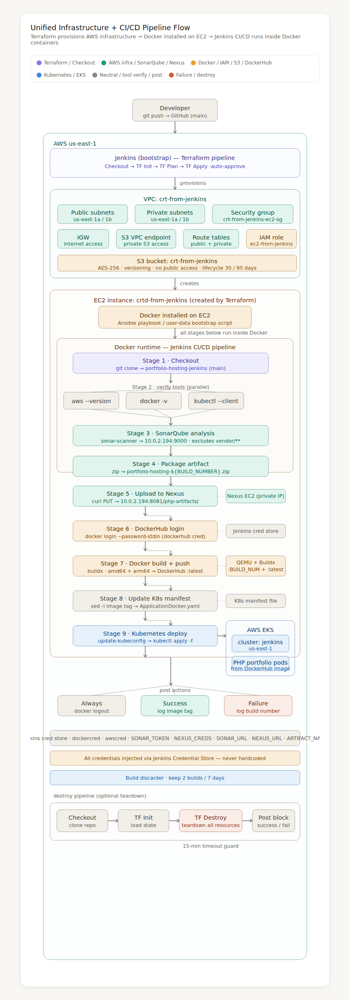

# End-to-End CI/CD Pipeline — PHP Portfolio on AWS EKS

> **Automated three-phase DevOps pipeline**: Terraform provisions AWS infrastructure → Jenkins CI/CD builds, tests, packages, and deploys a PHP portfolio website to AWS EKS → Prometheus + Grafana provide real-time observability.


[]


---

## Configuration

Before deploying, replace the following placeholders with your actual values:

| Placeholder | Description | Example |
|-------------|-------------|---------|
| `<JENKINS_EC2_PUBLIC_IP>` | Elastic IP of your Jenkins EC2 instance | Your EC2 public IP |
| `<JENKINS_EC2_PRIVATE_IP>` | Private IP of Jenkins EC2 within the VPC | Typically `10.0.x.x` |
| `<EKS_NODE_PRIVATE_IP>` | Private IP of the EKS worker node | Typically `10.0.x.x` |
| `<VPC_CIDR>` | CIDR block of your VPC | e.g. `10.0.0.0/16` |

> **Security note:** Never commit real IP addresses to a public repository. Use environment variables or parameter stores for sensitive infrastructure details.

---

## Architecture Diagram



> *Full three-phase flow: Terraform infrastructure provisioning → Jenkins CI/CD pipeline → AWS EKS deployment → Prometheus + Grafana observability*

---

## Project Overview

This project demonstrates a **production-grade, fully automated DevOps workflow** split into three interconnected phases:

| Phase | Description |
|-------|-------------|
| **Phase 1 — Infrastructure** | Jenkins triggers a Terraform pipeline that provisions the entire AWS environment (VPC, subnets, NAT Gateway, EC2, IAM, S3) |
| **Phase 2 — Application CI/CD** | On every `git push`, Jenkins runs a 10-stage pipeline: code quality → artifact packaging → multi-arch Docker build → EKS deployment → monitoring stack deployment |
| **Phase 3 — Observability** | Prometheus scrapes node metrics via Node Exporter; Grafana visualises CPU, RAM, Network and Disk in real time |

**Live traffic flow:**
```
Browser → <JENKINS_EC2_PUBLIC_IP>:30082  →  nginx  →  EKS node:30082  →  PHP portfolio pod
Browser → <JENKINS_EC2_PUBLIC_IP>:30090  →  nginx  →  EKS node:30090  →  Prometheus pod
Browser → <JENKINS_EC2_PUBLIC_IP>:30300  →  nginx  →  EKS node:30300  →  Grafana pod
                                                              ↑
                                              node-exporter:9100 (scrapes every 15s)
```

---

## Tech Stack

| Category | Tool / Service |
|----------|---------------|
| CI/CD Orchestration | Jenkins (Dockerised, custom image) |
| Infrastructure as Code | Terraform (modular — VPC, IAM, EC2, S3) |
| Code Quality | SonarQube 9.x (Dockerised, quality gate enforced) |
| Artifact Repository | Nexus Repository Manager (raw ZIP artifacts) |
| Container Registry | DockerHub (`debopriyoroy/portfolio-hosting`) |
| Container Build | Docker Buildx + QEMU (multi-platform: amd64 + arm64) |
| Container Orchestration | AWS EKS Auto Mode (Kubernetes 1.35) |
| Metrics Collection | Prometheus + Node Exporter DaemonSet |
| Visualisation | Grafana (Node Exporter Full dashboard — ID 1860) |
| Networking | VPC, public/private subnets, NAT Gateway, nginx reverse proxy |
| Cloud | AWS (us-east-1) — EC2, EKS, S3, IAM, VPC |

---

## Repository Structure

```
terrafrom-portfolio-hosting/
├── Jenkinsfile                  # 10-stage CI/CD pipeline (Stages 1-9 app + Stage 10 monitoring)
├── ApplicationPrivateNAT.yaml   # Active K8s Deployment + NodePort Service (port 30082)
├── Application.yaml             # Original manifest (reference only)
├── ApplicationDocker.yaml       # Alternate manifest (LoadBalancer variant)
├── monitoring/                  # Observability stack manifests
│   ├── namespace.yaml           # monitoring namespace
│   ├── prometheus-configmap.yaml# Scrape config: node-exporter + grafana + prometheus
│   ├── prometheus-deployment.yaml  # Prometheus deployment + NodePort 30090
│   ├── prometheus-rbac.yaml     # ServiceAccount + ClusterRole + ClusterRoleBinding
│   └── z-grafana-deployment.yaml   # Grafana deployment + NodePort 30300
├── dockerfile                   # PHP/Apache container image
├── sonar-project.properties     # SonarQube project config
├── composer.json                # PHP dependencies (PHPMailer)
├── index.html                   # Portfolio frontend
├── send-email.php               # Contact form backend
├── pipeline_diagram.png         # Architecture diagram image
└── README.md
```

---

## Phase 1 — Terraform Infrastructure

**Repository:** [ci-cd-terraform](https://github.com/DebopriyoRoy/ci-cd-terraform)

### AWS Resources Provisioned

| Module | Resource | Name |
|--------|----------|------|
| VPC | VPC | ci-cd-vpc (`<VPC_CIDR>`) |
| VPC | Public Subnets (×2) | ci-cd-subnet-public1/2-us-east-1a/b |
| VPC | Private Subnets (×2) | ci-cd-subnet-private1/2-us-east-1a/b |
| VPC | Internet Gateway | ci-cd-igw |
| VPC | NAT Gateway | ci-cd-nat (public subnet) |
| VPC | Route Tables | public + private (with correct associations) |
| IAM | Role + Instance Profile | ec2-from-jenkins |
| EC2 | Application Instance | jenkins-on-docker (t3.large) |
| S3 | Artifact + State bucket | Versioning, AES-256, lifecycle policy |

### Terraform Pipeline Stages

```
Checkout → Version Check → Init → Validate → Format Check → Plan → Apply → Show Outputs
                                                                              ↓
                                                                    [optional Destroy]
```

---

## Phase 2 — Application CI/CD Pipeline (10 Stages)

### Pipeline Stages

```
git push (main)
     │
     ▼
Stage 1  · Checkout               Pull source from GitHub
     ▼
Stage 2  · Verify Tools (parallel) aws --version | docker -v | kubectl version
     ▼
Stage 3  · SonarQube Analysis     sonar-scanner, project key: portfolio-deployment
     ▼
Stage 4  · Nexus Package Artifact zip -r portfolio-hosting-${BUILD_NUMBER}.zip
     ▼
Stage 5  · Upload to Nexus        curl PUT → php-artifacts repository
     ▼
Stage 6  · DockerHub Login        docker login --password-stdin
     ▼
Stage 7  · Docker Build & Push    Buildx linux/amd64+arm64 → debopriyoroy/portfolio-hosting
     ▼
Stage 8  · Update K8s Manifest    sed replaces image tag in ApplicationPrivateNAT.yaml
     ▼
Stage 9  · Kubernetes Deploy      aws eks update-kubeconfig → kubectl apply
     ▼
Stage 10 · Deploy Monitoring Stack kubectl apply -f monitoring/ → rollout status
```

### Full Jenkinsfile

```groovy
pipeline {
    agent any
    options {
        buildDiscarder logRotator(artifactDaysToKeepStr: '', artifactNumToKeepStr: '', daysToKeepStr: '7', numToKeepStr: '2')
    }
    environment {
        dockercred    = credentials('dockerhub')
        awscred       = credentials('aws-key')
        SONAR_TOKEN   = credentials('sonarqube-key')
        NEXUS_CREDS   = credentials('nexus-key')
        SONAR_URL     = 'http://<JENKINS_EC2_PRIVATE_IP>:9000'
        NEXUS_URL     = 'http://<JENKINS_EC2_PRIVATE_IP>:8081'
        ARTIFACT_NAME = "portfolio-hosting-${BUILD_NUMBER}.zip"
    }
    stages {
        stage('Checkout') {
            steps {
                checkout changelog: false, poll: false, scm: scmGit(
                    branches: [[name: '*/main']],
                    extensions: [],
                    userRemoteConfigs: [[url: 'https://github.com/DebopriyoRoy/terrafrom-portfolio-hosting.git']]
                )
            }
        }
        stage('Verify Tools') {
            parallel {
                stage('AWS Version')    { steps { sh 'aws --version' } }
                stage('Docker Version') { steps { sh 'docker -v' } }
                stage('Kubectl Version'){ steps { sh 'kubectl version --client' } }
            }
        }
        stage('SonarQube Analysis') {
            steps {
                withSonarQubeEnv('SonarQube') {
                    sh '''
                        sonar-scanner \
                            -Dsonar.projectKey=portfolio-deployment \
                            -Dsonar.sources=. \
                            -Dsonar.exclusions=vendor/**,**/*.java,src/**
                    '''
                }
            }
        }
        stage('Nexus Package Artifact') {
            steps { sh "zip -r ${ARTIFACT_NAME} . -x '*.git*' -x 'vendor/*' -x '*.zip'" }
        }
        stage('Upload to Nexus') {
            steps {
                sh '''
                    curl -u $NEXUS_CREDS_USR:$NEXUS_CREDS_PSW \
                        --upload-file ${ARTIFACT_NAME} \
                        ${NEXUS_URL}/repository/php-artifacts/${ARTIFACT_NAME}
                '''
            }
        }
        stage('DockerHub Login') {
            steps { sh 'echo $dockercred_PSW | docker login --username $dockercred_USR --password-stdin' }
        }
        stage('Docker Build & Push') {
            steps {
                sh '''
                    docker buildx create --use --name multiarch-builder || docker buildx use multiarch-builder
                    docker buildx build \
                        --platform linux/amd64,linux/arm64 \
                        -t debopriyoroy/portfolio-hosting:${BUILD_NUMBER} \
                        -t debopriyoroy/portfolio-hosting:latest \
                        --push .
                '''
            }
        }
        stage('Update Kubernetes Manifest') {
            steps {
                sh "sed -i 's#image: debopriyoroy/portfolio-hosting:.*#image: debopriyoroy/portfolio-hosting:${BUILD_NUMBER}#' ApplicationPrivateNAT.yaml"
            }
        }
        stage('Kubernetes Deploy') {
            steps {
                sh 'aws eks update-kubeconfig --region us-east-1 --name jenkins'
                sh 'kubectl apply -f ApplicationPrivateNAT.yaml'
            }
        }
        stage('Deploy Monitoring Stack') {
            steps {
                sh 'kubectl apply -f monitoring/namespace.yaml'
                sh 'sleep 3'
                sh 'kubectl apply -f monitoring/'
                sh 'kubectl rollout status deployment/prometheus -n monitoring --timeout=120s'
                sh 'kubectl rollout status deployment/grafana -n monitoring --timeout=120s'
            }
        }
    }
    post {
        always {
            echo "Pipeline completed - Build #${BUILD_NUMBER}"
            sh 'docker logout'
        }
        success {
            echo "Deployment successful - Image: debopriyoroy/portfolio-hosting:${BUILD_NUMBER}"
        }
        failure {
            echo "Pipeline failed - Check logs for Build #${BUILD_NUMBER}"
        }
    }
}
```

---

## Phase 3 — Observability Stack

### Monitoring Architecture

```
Prometheus pod (monitoring namespace)
       │
       │  scrapes every 15s via cluster DNS
       ▼
node-exporter.prometheus-node-exporter.svc.cluster.local:9100
       │
       │  exposes CPU, RAM, Disk, Network per node
       ▼
Grafana pod (monitoring namespace)
       │
       │  queries Prometheus datasource
       ▼
Node Exporter Full Dashboard (ID: 1860)
```

### Prometheus Scrape Config (`monitoring/prometheus-configmap.yaml`)

```yaml
scrape_configs:
  - job_name: 'prometheus'
    static_configs:
      - targets: ['localhost:9090']
  - job_name: 'node-exporter'
    static_configs:
      - targets:
        - 'prometheus-node-exporter.prometheus-node-exporter.svc.cluster.local:9100'
  - job_name: 'grafana'
    static_configs:
      - targets:
        - 'grafana-service.monitoring.svc.cluster.local:3000'
```

### Prometheus Target Health

| Job | Endpoint | State |
|-----|----------|-------|
| prometheus | localhost:9090 | UP |
| node-exporter | prometheus-node-exporter...svc.cluster.local:9100 | UP |
| grafana | grafana-service.monitoring.svc.cluster.local:3000 | UP |

### Access URLs

| Service | URL | Credentials |
|---------|-----|-------------|
| Portfolio App | `http://<JENKINS_EC2_PUBLIC_IP>:30082` | None |
| Prometheus | `http://<JENKINS_EC2_PUBLIC_IP>:30090` | None |
| Grafana | `http://<JENKINS_EC2_PUBLIC_IP>:30300` | admin / admin123 |

### Useful Prometheus Queries

```promql
# CPU usage %
rate(node_cpu_seconds_total{mode!="idle"}[5m]) * 100

# Available memory %
node_memory_MemAvailable_bytes / node_memory_MemTotal_bytes * 100

# Network receive rate
rate(node_network_receive_bytes_total[5m])

# Disk usage %
100 - (node_filesystem_avail_bytes / node_filesystem_size_bytes * 100)

# 1-min load average
node_load1
```

### Load Testing

```bash
# Install ApacheBench
sudo yum install httpd-tools -y

# Run load test (200 requests, 5 concurrent)
ab -n 200 -c 5 -s 60 http://<JENKINS_EC2_PUBLIC_IP>:30082/

# Heavy load test (keep-alive)
ab -n 10000 -c 100 -s 120 -k http://<JENKINS_EC2_PUBLIC_IP>:30082/
```

Watch Grafana **Node Exporter Full** dashboard with 5s refresh to see CPU, Network and System Load spike in real time.

---

## Kubernetes Manifests

### ApplicationPrivateNAT.yaml (Portfolio App)

```yaml
apiVersion: apps/v1
kind: Deployment
metadata:
  name: portfolio-deployment
  labels:
    app: portfolio
spec:
  replicas: 2
  selector:
    matchLabels:
      app: portfolio
  strategy:
    type: RollingUpdate
    rollingUpdate:
      maxUnavailable: 0
      maxSurge: 1
  template:
    metadata:
      labels:
        app: portfolio
    spec:
      tolerations:
      - key: "eks.amazonaws.com/compute-type"
        operator: "Equal"
        value: "auto"
        effect: "NoSchedule"
      containers:
      - name: portfolio-website
        image: debopriyoroy/portfolio-hosting:latest
        imagePullPolicy: Always
        ports:
        - containerPort: 80
        resources:
          requests:
            cpu: "100m"
            memory: "128Mi"
          limits:
            cpu: "500m"
            memory: "256Mi"
        livenessProbe:
          httpGet:
            path: /
            port: 80
          initialDelaySeconds: 10
          periodSeconds: 10
          failureThreshold: 3
        readinessProbe:
          httpGet:
            path: /
            port: 80
          initialDelaySeconds: 5
          periodSeconds: 5
          failureThreshold: 3
---
apiVersion: v1
kind: Service
metadata:
  name: portfolio-service
spec:
  type: NodePort
  selector:
    app: portfolio
  ports:
  - protocol: TCP
    port: 80
    targetPort: 80
    nodePort: 30082
```

---

## EKS Cluster Configuration

| Property | Value |
|----------|-------|
| Cluster name | jenkins |
| Region | us-east-1 |
| Kubernetes version | 1.35 |
| Mode | EKS Auto Mode |
| Node instance | c6g.large (ARM64, Bottlerocket OS) |
| Node subnet | private subnet only (no public IP) |
| API endpoint | Public and Private |
| NAT Gateway | Required for private node image pulls |

---

## Jenkins Toolchain Setup

All tools run as Docker containers on the Jenkins EC2 (`<JENKINS_EC2_PRIVATE_IP>`):

| Tool | Image | Port | Purpose |
|------|-------|------|---------|
| Jenkins | custom-jenkins | 8080 | Pipeline orchestration |
| SonarQube | sonarqube:community | 9000 | Static analysis + quality gate |
| Nexus | sonatype/nexus3 | 8081 | Raw ZIP artifact repository |

### Jenkins Credentials Required

| ID | Type | Used For |
|----|------|----------|
| `dockerhub` | Username/Password | DockerHub image push |
| `aws-key` | AWS Credentials | EKS kubeconfig + AWS CLI |
| `sonarqube-key` | Secret Text | SonarQube analysis token |
| `nexus-key` | Username/Password | Nexus artifact upload |

---

## Key Engineering Challenges Solved

| Challenge | Root Cause | Fix |
|-----------|------------|-----|
| Pods stuck in Pending | EKS Auto Mode requires specific toleration | Added `eks.amazonaws.com/compute-type: auto` toleration |
| `ImagePullBackOff` on private nodes | No NAT Gateway — nodes couldn't reach internet | Created NAT Gateway in public subnet + updated private route tables |
| `sed: unknown option to 's'` | Pipe `\|` delimiter conflicted with image path | Switched sed delimiter from `\|` to `#` |
| ARM64/x86 architecture mismatch | Jenkins EC2 is x86, EKS nodes are ARM64 | Multi-platform Buildx build with QEMU |
| Grafana namespace not found | kubectl apply -f sorts alphabetically | Apply namespace.yaml first, then rest of monitoring/ |
| Prometheus targets 400 Bad Request | EKS Auto Mode blocks direct kubelet port 10250 | Switched to Node Exporter DaemonSet on port 9100 |
| ConfigMap not updating | kubectl apply unchanged due to annotation hash | kubectl delete configmap then re-apply |
| nginx proxy broken after node replacement | EKS Auto Mode replaces nodes, IPs change | Update nginx proxy_pass with new node IP via kubectl get nodes |
| App unreachable from browser | EKS node is private — no public IP | nginx reverse proxy on Jenkins EC2 for all 3 ports |

---

## Prerequisites

### Jenkins Credentials

```
dockerhub      → DockerHub username + password
aws-key        → AWS Access Key ID + Secret Access Key
sonarqube-key  → SonarQube Global Analysis Token (Secret Text)
nexus-key      → Nexus username + password
```

### EC2 System Settings (for SonarQube/Elasticsearch)

```bash
sudo sysctl -w vm.max_map_count=262144
sudo sysctl -w fs.file-max=65536
```

### nginx Reverse Proxy (on Jenkins EC2)

```bash
sudo yum install nginx -y

# Portfolio app
sudo tee /etc/nginx/conf.d/portfolio.conf > /dev/null <<'EOF'
server {
    listen 30082;
    location / {
        proxy_pass http://<EKS_NODE_PRIVATE_IP>:30082;
        proxy_set_header Host $host;
        proxy_set_header X-Real-IP $remote_addr;
    }
}
EOF

# Monitoring stack
sudo tee /etc/nginx/conf.d/monitoring.conf > /dev/null <<'EOF'
server {
    listen 30090;
    location / {
        proxy_pass http://<EKS_NODE_PRIVATE_IP>:30090;
        proxy_set_header Host $host;
        proxy_set_header X-Real-IP $remote_addr;
    }
}
server {
    listen 30300;
    location / {
        proxy_pass http://<EKS_NODE_PRIVATE_IP>:30300;
        proxy_set_header Host $host;
        proxy_set_header X-Real-IP $remote_addr;
    }
}
EOF

sudo systemctl enable nginx && sudo systemctl start nginx
```

> **Note:** If EKS Auto Mode replaces the node, update the node IP in both nginx configs:
> ```bash
> NODE_IP=$(kubectl get nodes -o jsonpath='{.items[0].status.addresses[?(@.type=="InternalIP")].address}')
> sudo sed -i "s|proxy_pass http://.*:30082|proxy_pass http://$NODE_IP:30082|g" /etc/nginx/conf.d/portfolio.conf
> sudo sed -i "s|proxy_pass http://.*:300|proxy_pass http://$NODE_IP:300|g" /etc/nginx/conf.d/monitoring.conf
> sudo nginx -t && sudo systemctl reload nginx
> ```

---

## Quick Reference

```bash
# Check all pods
kubectl get pods --all-namespaces

# Check nodes with IPs
kubectl get nodes -o wide

# Check services
kubectl get service portfolio-service
kubectl get service -n monitoring

# Prometheus target health
# http://<JENKINS_EC2_PUBLIC_IP>:30090/targets

# Restart deployments
kubectl rollout restart deployment/portfolio-deployment
kubectl rollout restart deployment/prometheus -n monitoring
kubectl rollout restart deployment/grafana -n monitoring

# Check nginx
sudo systemctl status nginx
sudo nginx -t
```

---

## Author

**Debopriyo Roy** — Cloud & DevOps Engineer
[GitHub](https://github.com/DebopriyoRoy) · [DockerHub](https://hub.docker.com/u/debopriyoroy)
